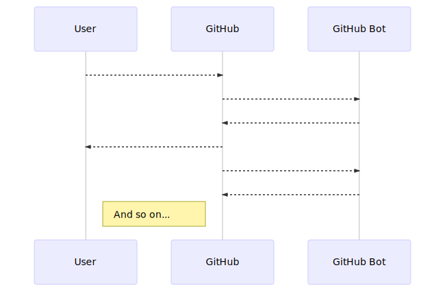

import 'resources/styles.css';

export { swiss as theme } from 'mdx-deck/themes'

# Building GitHub Bots / Apps
...and the [bpmn.io](http://bpmn.io/) pull request flow.

---

## GitHub Bot / App

An application that consumes events (emitted by GitHub) and drives workflow via GitHub REST or GraphQL API.

---

## Examples

* Automate dependency update notifications
* Automate CI run scheduling
* Automate merged branch deletion
* Automate issue commenting / marking / closing
* Automate merging, once all required checks pass
* Rich user interaction via issues
* ...

---

## Flow

---

## Event Subscription via Web Hooks

GitHub allows you to register web hooks, URLs that are being  invoked once anything happens.

---

## Driving GitHub via API

REST API (so 2017) or GraphQL API.

---

## Security Model

Apps are authenticated by organization owners on a per-project level.

Apps must declare consumed events and access to project and user resources on a fine grained level (i.e. _read issues_, _write issue comments_).

Apps may impersonate users (to a certain extend) to perform actions on behalf of the user.

---

## [Probot](https://probot.github.io): A Framework to Build Apps

* Node app framework
* Easy setup (app registration)
* Bundles REST + GraphQL clients
* Features [example apps/bots](https://probot.github.io/apps/)
* Apps can be mixed and matched under new identity

---

## Example 1: [merge-me](https://github.com/nikku/merge-me)

---

## Example 2: [waffle.io](https://waffle.io/)

---

## [Deployment](https://probot.github.io/docs/deployment/)

Any free / payed tier [PaaS](https://en.wikipedia.org/wiki/Platform_as_a_service) hosting service:

* Heroku
* Now
* ...

---

## ?