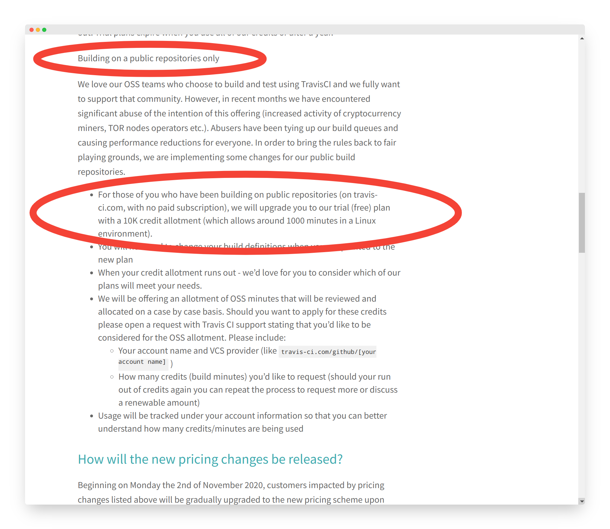

# *Travis CI*

### How to screw with your users in five easy steps.

<small>[`Nico Rehwaldt`](https://github.com/nikku) 2020</small>

---

### *Rant* The extensive talk about a given topic longer than needed whether anyone cares or not.

:arrow_right: [Urban dictionary](https://www.urbandictionary.com/define.php?term=Rant)

---

---

---

## *Travis CI is great*

* Infrastructure as code
* The first CI system to properly integrate with GitHub
* Free for open-source

---

---

---

## *Step 1* Free for Open-Source

---

## *Step 1* ~~Free for Open-Source~~

---

## *Step 1* ~~Free for Open-Source~~

## ~~Free Beer~~

## ~~Free Coffee~~

---

---

---

## *Step 2* Stay Vague and Act Quickly

---

* Write a blog post, kinda, but...
* *Keep massive change hidden* behind PR Bla Bla
* Leave *no grace period*
* The post will make sense the moment people see you act!
* *Notify? Who cares!*

---

---

---

## *Step 2.1* Back up Your Strategy Shift

---

---

## *Step 3* What I See is What I Do Not Understand

---

---

* Partial rollout, the way it is done
* *No announcement*
* Buggy progress bar
* Do not link resources for further help
* Once countdowns tick, your users will learn the hard way

---

---

## *Step 3.1* Usage vs. User-based Tiers

---

---

## *Step 3.2* Pay Monthly + Pay Pre-Paid

---

---

## *Step 4* Pretend to Not be Where You're Needed the Most

---

---

---

---

# *Travis CI*, you had one job.

---

## *Step 5* Make Your Users Love the Little Things

---

## *For personal projects I went down the apply for free OSS plan path.*

#### Took three weeks to get a response after a comprehensive application from my side. They gave up and handed me 50000 prepaid credits without settling the case.

---

## *On the Camunda side we had credit card payment issues.*

#### They ended up charging us twice for additional credits (my bad). We asked for a refund but gave up eventually. Got plenty of credits to burn now.

---

---

## _One a Friday afternoon I prognosed that our free credits would last until Tuesday._

### Then we did start to build Camunda BPM Docker images on Travis in a project outside my sphere.

---

---

# *TLDR* Travis CI Wants you to go

---

---

## Resources

* https://blog.travis-ci.com/2020-11-02-travis-ci-new-billing
* https://blog.travis-ci.com/oss-announcement
* https://docs.github.com/en/free-pro-team@latest/actions
* https://github.com/nikku/continuous-delivery-without-jenkins-tm