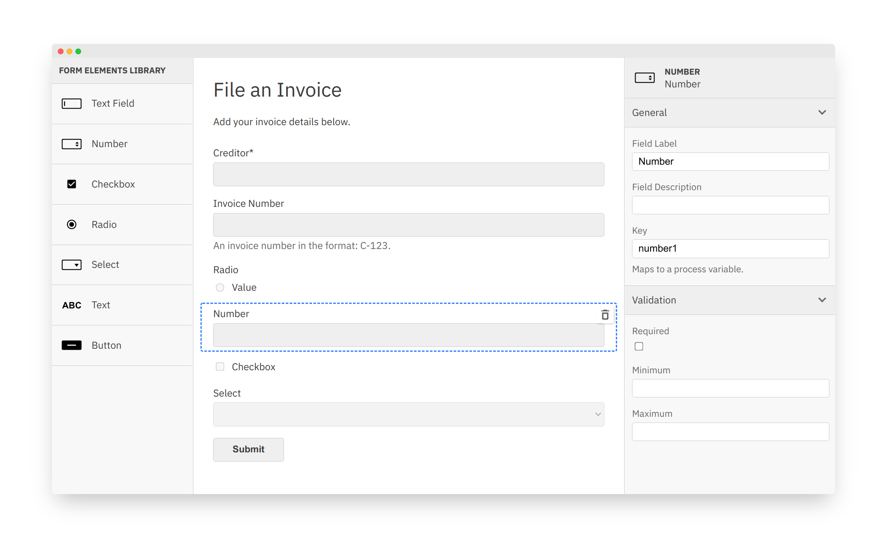

# *form-js 0.2.0*

#### What's Inside?

<br/>
<br/>

<small>Philipp Fromme, <a href="https://github.com/nikku"><code>@nikku</code></a></small>

---

<!--config
  theme=eco
-->

## A major step forward

#### For users _supporting moderately complex forms_

#### For developers offering the known _bpmn.io-like experience_

---

## Built With Dependency Injection :electric_plug:

---

#### Viewer

```javascript
const form = await createForm({
  container,
  data,
  schema,
  additionalModules: [
    customModule
  ]
});

const eventBus = form.get('eventBus');
```

:thumbsup:

---

#### Editor

```javascript
const form = await createFormEditor({
  container,
  schema,
  additionalModules: [
    customModule
  ]
});

const commandStack = form.get('commandStack');
```

:thumbsup:

---

### Why?

* Extensibility now built-in
* Allows for a proper test setup
* Alignment with other bpmn.io toolkits

---

## Separate Instantiation and Import

```javascript
const form = new Form({
  container,
  additionalModules: [
    customModule
  ]
});

try {
  await form.importSchema(schema, data);
} catch (err) {
  // ...
}
```

---

### Why?

* Instances can be reused
* Instantiation errors and import errors separated
* Alignment with other bpmn.io toolkits

---

## Async Import

---

#### Before

```javascript
try {
  const form = createForm({
    container,
    data,
    schema: brokenSchema
  });
} catch (err) {
  // Nope
}
```

Why can't I catch the error? :confused:

---

#### After

```javascript
const form = new Form({
  container
});

try {
  await form.importSchema(schema, data);
} catch (err) {
  console.log(err); // Error: form field of type <foo> not supported
}
```

:thumbsup:

---

### Why?

* Import errors can be handled
* Shallow validation on import
* Indicate unsupported form fields and duplicate `key`s

---

## New Form Fields

* number
* radio
* select
* text (markdown)

---



---

### Why?

Support our _Moderately Complex Forms_ strategy.

---

## Many More Things

* UI/UX improvements and bug fixes
* A clear story around bundling and distribution
* UMD distro
* [Types without TypeScript](https://github.com/nikku/types-without-typescript)
* A [demo installation](https://demo.bpmn.io/form)

---

<!--config
  theme=eco
-->

## Thanks :clap:

---

## Resources

* [GitHub](https://github.com/bpmn-io/form-js)
* [Demo](https://demo.bpmn.io/form)
* [Changelog](https://github.com/bpmn-io/form-js/blob/master/packages/form-js/CHANGELOG.md), [v0.1.0...v0.2.1](https://github.com/bpmn-io/form-js/compare/v0.1.0...v0.2.1)