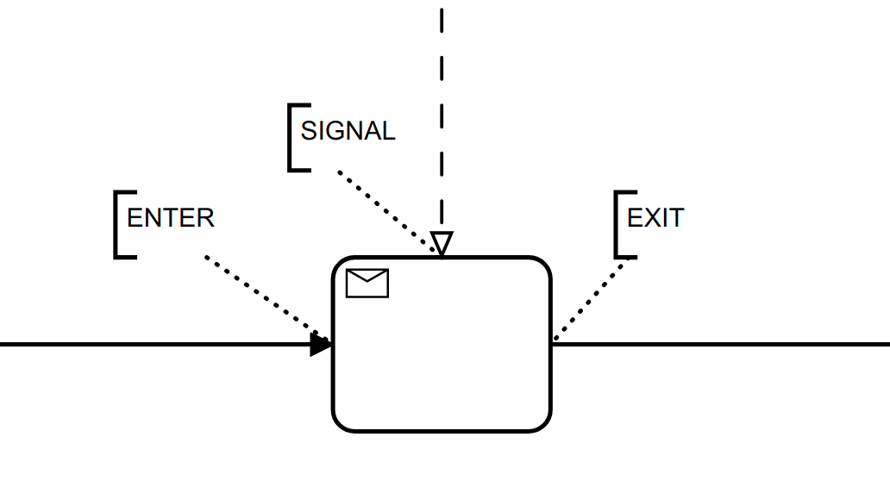
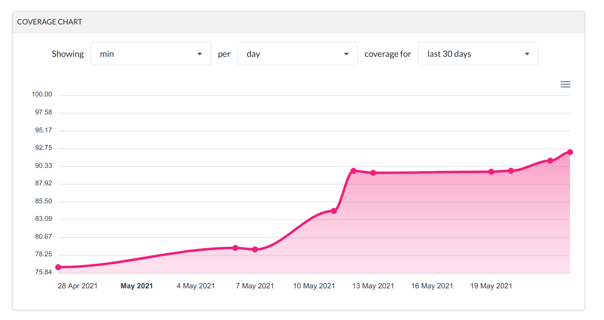
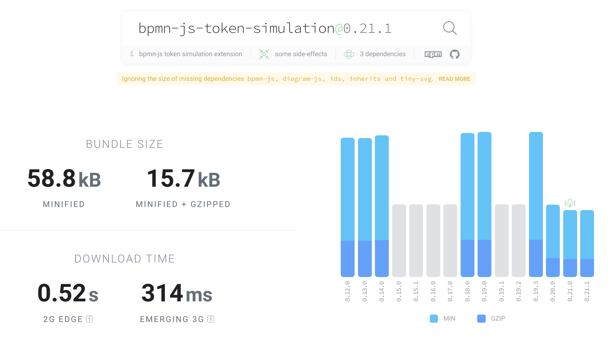

## bpmn-js Token Simulation Internals

##### An update on [recent improvements](https://github.com/bpmn-io/bpmn-js-token-simulation/compare/v0.11.1...v0.21.1).

[<small style="font-size: .5em">Nico Rehwaldt</small>](https://github.com/nikku)


---

## About Me

* Software developer at Camunda
* bpmn.io creator and project lead
* [`@nikku`](https://github.com/nikku) on GitHub

---

## Agenda

:one: Where we started

:two: What we accomplished

---

## :one: Where we Started

---

[](https://github.com/nikku/2021-token-simulation)

---

## Camunda Community Summit

* Presentation received positive feedback
* Also highlighted some issues

---

## It is a fun project to hack upon.

---

## :arrow_right: Let's go!

---

## Goals

* Gain a deep understanding of token-simulation
* Improve maintainability :arrow_right: Make contributions possible
* Make it work (BPMN 2.0 compliant) and powerful (complex BPMN elements)

---

## :two: What we Accomplished

---

[](https://bpmn-io.github.io/bpmn-js-token-simulation/)

---


## In a Nutshell

* A standalone simulator
* A solid execution model
* An improved testing story
* Just add animations
* General housekeeping

---

## A Standalone Simulator

🟡 Single instance process-engine, scattered across [the whole code base](https://github.com/bpmn-io/bpmn-js-token-simulation/tree/v0.11.1), i.e. [context pad handlers](https://github.com/bpmn-io/bpmn-js-token-simulation/blob/v0.11.1/lib/features/context-pads/handler/BoundaryEventHandler.js) and [simulation behavior](https://github.com/bpmn-io/bpmn-js-token-simulation/blob/v0.11.1/lib/features/token-simulation-behavior/handler/BoundaryEventHandler.js).

🟢 [Dedicated, multi-instance simulator](https://github.com/bpmn-io/bpmn-js-token-simulation/blob/master/lib/simulator/Simulator.js) with own state management. Driven via API, hooked into via events.

🟢 Executes signals, escalation, message flows and most other complex BPMN behaviors.

---

## A Solid Execution Model

🟢 Scopes represent activities

🟢 Behaviors implement element specific scope _enter_, _exit_ and _signal_ (user trigger) actions

---



---

## 🟢 Drive the Simulation

```javascript
const processElement = elementRegistry.get('Process');
const startEventElement = elementRegistry.get('StartEvent');

// start instance of <Process>
simulator.signal({
  element: processElement,
  startEvent: startEventElement
});
```

---

## 🟢 Query Active Scopes

```javascript
const processElement = elementRegistry.get('Process');

// active instances in <Process>
const runningScopes = simulator.findScopes({
  element: processElement
});
```

---

## 🟢 Register a Behavior

```javascript
function TaskBehavior(simulator) {
  simulator.registerBehavior('bpmn:Task', this);
}
```

---

## 🟢 Exit a Task

```javascript
TaskBehavior.prototype.exit = function(context) {
  context.element.outgoing.filter(isSequenceFlow).map(flow => {
    simulator.enter({
      element: flow,
      parentScope: context.scope.parent
    });
  });
};
```

---

## An Improved Testing Story

🟡 UI integration testing only.

🟢 [Dedicated tests](https://github.com/bpmn-io/bpmn-js-token-simulation/blob/master/test/spec/simulator/SimulatorSpec.js) against the simulator API.

🟢 [UI tests](https://github.com/bpmn-io/bpmn-js-token-simulation/blob/master/test/spec/SimulationSpec.js) as a layer on top.


---

## 🟢 Dedicated Simulator Tests

```javascript
verify('simple', () => {

  // when
  signal({
    element: element('Process_1')
  });

  // then
  expectTrace(...);
});
```

---

## 🟢 UI-based Integration Tests

```javascript
it('should execute happy path', async function() {

  // when
  triggerElement('StartEvent_1');

  await scopeDestroyed();

  // then
  expectHistory(...);
});
```

---

## 🟢 Test Cover All Things!

[](https://app.codecov.io/gh/bpmn-io/bpmn-js-token-simulation)

---

## 🟢 Just Add Animation

```javascript
AnimatedSequenceFlowBehavior.prototype.enter = function(context) {

  const {
    element,
    scope
  } = context;

  this._animation.animate(element, scope, () => {
    SequenceFlowBehavior.prototype.enter.call(this, context);
  });
};
```
---

## General Housekeeping

🟢 Migrate to ES modules

🟢 Migrate to GitHub actions

🟢 Remove `SVG.js` in favor of own animation core

---

[](https://bundlephobia.com/result?p=bpmn-js-token-simulation)

---

### And [more improvements](https://github.com/bpmn-io/bpmn-js-token-simulation/blob/master/CHANGELOG.md).

---

## Even more could be done

* Visual token trace
* Life- / deadlock detection
* Transactions
* ...

---

<!--config
theme=eco
-->

# [Try it out!](https://bpmn-io.github.io/bpmn-js-token-simulation/)

---

## Thank you. <span style="color: #ff5500">Questions?</span>

---

<!--config
theme=eco
-->

## Contribute to Token Simulation

#### You like the token simulation tool? Consider contributing [on Github](https://github.com/bpmn-io/bpmn-js-token-simulation) and help us to make it even better :heart:.

---

## Resources

* https://github.com/bpmn-io/bpmn-js-token-simulation
* https://github.com/nikku/2021-token-simulation