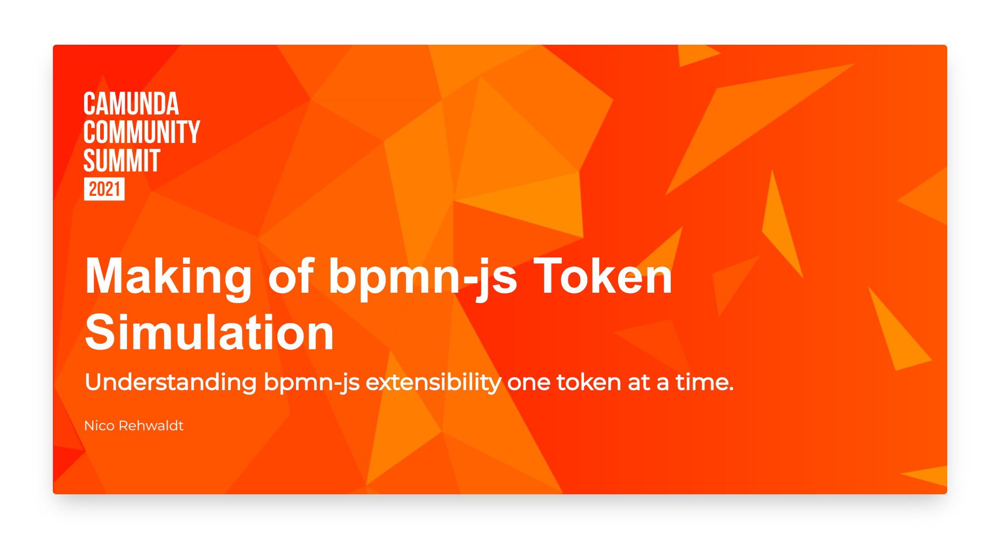

# Making of Token Simulation

A bpmn.io talk I gave at the [Camunda Community Summit 2021](https://summit.camunda.com).

[:arrow_right: Slides](https://nikku.github.io/talks/2021-token-simulation/presentation.html)

---

Slide deck built with [`pfwr`](https://github.com/nikku/pfwr) - Turns your markdown files into a beautiful slide deck.
