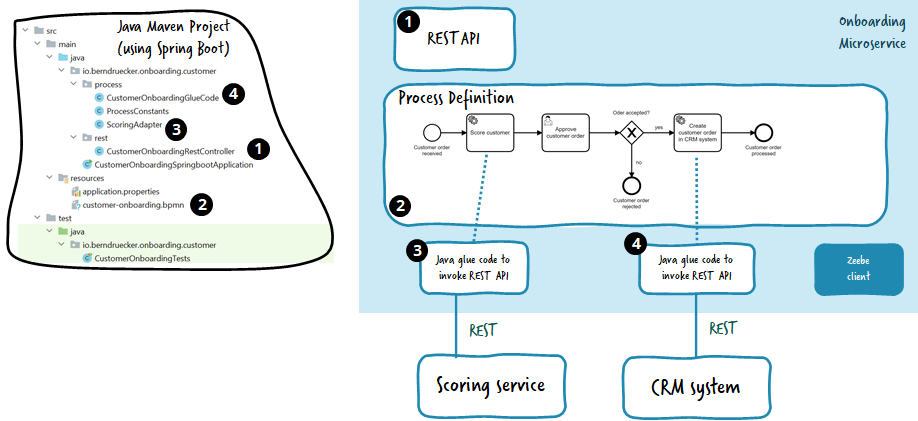

# Camunda Connectors

#### Re-usable building blocks for safe + happy automation

<small><a href="https://github.com/nikku">Nico Rehwaldt</a></small>

---

## Camunda for _Professional Developers_

---

<!--config
align=center
theme=eco
-->

### Implementing Behavior

---


---

```javascript
var client = clientBuilder.build();

var workerRegistration =
  client
    .newWorker()
    .jobType("collect-money")
    .handler(new CollectMoneyJobHandler())
    .open();
```

---

```javascript
class CollectMoneyJobHandler implements JobHandler {

  @Override
  public void handle(JobClient client, ActivatedJob job) {

    // collect that money!

    client.newCompleteCommand(job).send().join();
  }
}
```

---


---

<!--config
align=center
theme=eco
-->
### Building Automation Projects

---


---

### [Process Application](https://docs.camunda.io/docs/components/best-practices/development/connecting-the-workflow-engine-with-your-world/#designing-process-solutions-containing-all-glue-code)

* A project that contains all business logic and/or glue code.
* Deploys the process + registers job workers on start).
* Tested, of course (eg. [zeebe-process-test](https://github.com/camunda/zeebe-process-test)).

---

[](https://docs.camunda.io/docs/components/best-practices/development/connecting-the-workflow-engine-with-your-world/#designing-process-solutions-containing-all-glue-code)

---

### Core Automation Takeaways

* Builder is _Developer_ persona
* Single package contains everything
* Built using development practices
* Tested and shipped via standard CI/CD tools
* Variables are implicit (and/or in code)

---

<!--config
align=center
theme=funky
-->

## A strong story and the foundation of our success

---

## Camunda for _Larger Organizations_

---

## Camunda for _Everyone Else Really_

---

<!--config
align=center
theme=eco
-->

### Safe and happy automation for everyone

---

### (Some) Needs

* Build upon existing building blocks
* Model domain specific, not engine specific
* Explicit variables + hinting
* Detailed diagram validation

---


---

### Connectors

Re-usable building blocks for *modeling* + *execution*.

---


---

### Modeling

:arrow_right: [Element Templates](https://docs.camunda.io/docs/components/modeler/desktop-modeler/element-templates/about-templates/) (aka "Connector Templates")

---

### Execution

:arrow_right: [Connector SDK](https://github.com/camunda/connector-sdk)

---


---

### Connector SDK

* Foundation for re-usable behavior ("run-time")
* Simple to use API to build against
* Simple to test
* Environment agnostic
* Adapters to run (as job worker, in C8 SaaS)
* [SPIs](https://en.wikipedia.org/wiki/Service_provider_interface) allow to hook up shared behavior (i.e. secrets handling)

---

```javascript
public class CollectMoneyConnector implements ConnectorFunction {

  @Override
  public Object execute(ConnectorContext context) throws Exception {

    var request = context.getVariablesAsType(CollectMoneyInput.class);

    var validator = new Validator();
    request.validate(validator);
    validator.validate();

    request.replaceSecrets(context.getSecretStore());

    // actually get that money!

    return new CollectMoneyResponse("Took " + request.getAmount() + " bucks!");
  }
}
```

---

```javascript
import io.camunda.connector.runtime.jobworker.ConnectorJobHandler;
import io.camunda.zeebe.client.ZeebeClient;

public class Main {

  public static void main(String[] args) {

    var zeebeClient = ZeebeClient.newClientBuilder().build();

    zeebeClient.newWorker()
        .jobType("collect-money")
        .handler(new ConnectorJobHandler(new CollectMoneyFunction()))
        .name("collect-money")
        .fetchVariables("bucket", "amount")
        .open();
  }
}
```

---

### Takeaways

* Our goal is to enable users to *create* + *ship* *re-usable building blocks*, but also to *use* what is already there (community / market place?)

* Element Templates / Connector SDK enforce *best practices* for implementation and ensure *safe re-use*

---

### Next Steps (2022-08-15)

* Ship Element Templates: Conditional properties
* Ship (publish) [Connector SDK (outbound)](https://github.com/camunda/connector-sdk)
* Investigate [Connector SDK (inbound)](https://miro.com/app/board/uXjVOnWkTP4=/)
* Build more connectors (inhouse)

---

### Footnote on Inbound

* [Inbound](https://miro.com/app/board/uXjVOnWkTP4=/) is complicated
* :arrow_right: You'll see more benefits from an SDK

---

## Thanks

# :heart: