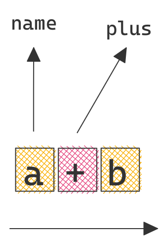
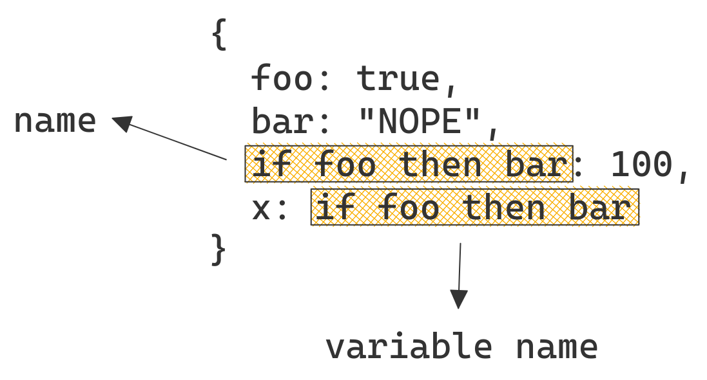

# Contextual Language Parsing

#### Lessons learned while implementing a [parser](https://github.com/nikku/lezer-feel) and [interpreter](https://github.com/nikku/feelin) for DMN FEEL

<small><a href="https://github.com/nikku">Nico Rehwaldt</a> 2022</small>

---

## Language Parser

A tool (or human) that understands the meaning behind (written) text.

---

```javascript
if (!fs.existsSync(inputFile)) {
  console.log('Created %s', inputFile);

  fs.copyFileSync(__dirname + '/template.md', inputFile);
}
```

---

## How do computers parse language?

---

## Tokenization

Produce (terminal) symbols from the input.

---



---

## Parsing

Match symbols against grammar to produce a syntax tree.

There exists many strategies to do this: Top-down ([Earley](https://en.wikipedia.org/wiki/Earley_parser)) or bottom up ([LR parsing](https://en.wikipedia.org/wiki/LR_parser), [PEG](https://en.wikipedia.org/wiki/Parsing_expression_grammar)).

---

## Grammar Defines Interpretation

```plain
a + b

# can be arithmetic operation (a) + (b)
# or name (a,+,b)
# depending on <grammar>
```

---

## Language Classes

[Chomsky hierarchy](https://en.wikipedia.org/wiki/Chomsky_hierarchy) defines different classes of languages.

Most sane (programing-) languages are _context free_.

_Context sensitive_ languages on the other end require full context for parsing.

---


## Grammar + Context Defines Interpretation

```plain
a + b

# can be arithmetic operation (a) + (b)
# or name (a,+,b)
# depending on <grammar> + <context>
```

---

## Context Sensitivity

Let's take _OR_ as an example.

---

## `XOR`

```plain
Live or death?

Öhm...
```

---

## Classic `OR`

```plain
What do you want for dinner? Noodles, potatoes, soup or just buns?

Yes.
```

---

## Human language is _context sensitive_

---

## FEEL is _context sensitive_

---

```plain
{
  foo: true,
  bar: "NOPE",
  if foo then bar: 100,
  x: if foo then bar
}
```

---



---

## Implications

* Parsing is *context senstivie*
* Tokenizing is *context sensitive*
* Tokenize, parse and interpret at the same time

---

## A quick look at [`lezer-feel`](https://github.com/nikku/lezer-feel)

---

## Thanks

# :heart:

---

## Resources

* [`lezer` language parsing toolkit](https://lezer.codemirror.net/)
* [`lezer-feel`](https://github.com/nikku/lezer-feel)