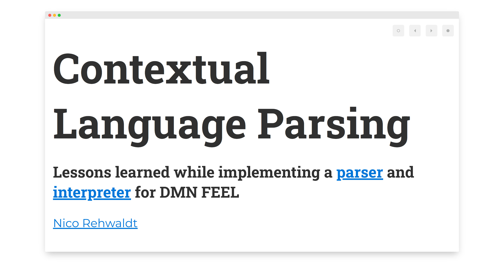

# Contextual Language Parsing - Vol 2.

#### (Ab)using [Lezer](https://lezer.codemirror.net/) to build context sensitivity into [lezer-feel](https://github.com/nikku/lezer-feel).

<small>[`Nico Rehwaldt`](https://github.com/nikku) 2022</small>

---

## Recap :arrow_down:

<a href="https://nikku.github.io/talks/2022-context-sensitive-language-parsing-feel/" target="_blank" style="display: block; max-width: 100%; overflow: hidden;">
  
</a>

---

## Context Sensitivity

_Context sensitive_ languages require full context for parsing.

---

## Grammar + Context Defines Interpretation

```plain
a + b

# can be arithmetic operation (a) + (b)
# or name (a,+,b)
# depending on <grammar> + <context>
```

---

## [Lezer](https://lezer.codemirror.net/)

* Language parsing toolkit for the _editing use-case_
* Forgiving (handles broken input)
* Quick (re-evaluates partially)
* Embeddable + customizable
* Supported natively in [CodeMirror 6](https://codemirror.net/)

---

## Technical Details

* A [LR(1)](https://en.wikipedia.org/wiki/Canonical_LR_parser) parser, a type of [shift-reduce parser](https://en.wikipedia.org/wiki/Shift-reduce_parser)
* Options to handle ambiguity through [GLR](https://en.wikipedia.org/wiki/GLR_parser) parsing (needs to be explicitly flagged in the grammar)

---

## Foundation for FEEL* language support

* [lezer-feel](https://github.com/nikku/lezer-feel) - FEEL grammar
* [lang-feel](https://github.com/nikku/lang-feel) - Language definitions for CodeMirror 6
* [feelin](https://github.com/nikku/feelin) - FEEL interpreter written in JavaScript

---

## Provides some powerful utilities

* [Grammar Driven](https://lezer.codemirror.net/docs/guide/#writing-a-grammar)
* [External Tokens + context tracking](https://lezer.codemirror.net/docs/guide/#external-tokens)

---

## External Tokenization

* Be able to parse the token steam ourselves (programmatically) and produce tokens

    ```
    input -> token(s)
    ```

---

## Context Tracking

* Track internal parse state as the parser operates

    ```
    context + (shift/reduce symbol) -> new context
    ```

* Information can be fed into tokenizer to implement contextual parsing

---

## What is Contextual in FEEL?

* [Names (vs. expressions)](https://nikku.github.io/feel-playground/?e=if+this+then+that&c=%7B%0A++%22if+this+then+that%22%3A+100%0A%7D&t=expression)
* [Expressions (may be eagerly cut)](https://nikku.github.io/feel-playground/?e=1%0A3+%2B+10&c=%7B%0A%7D&t=expression)

---

## [Demo + Code Review](https://github.com/nikku/lezer-feel)

---

```javascript
import {
  parser,
  trackVariables
} from 'lezer-feel';

const contextTracker = trackVariables({
  'if foo then bar': 1
});

const contextualParser = parser.configure({
  contextTracker
});

// recognizes <if foo then bar> as a <VariableName>
contextualParser.parse('if foo then bar');
```

---

## Summary

* We use [context tracking](https://github.com/nikku/lezer-feel/blob/master/src/feel.grammar#L401) and [external tokenization](https://github.com/nikku/lezer-feel/blob/master/src/feel.grammar#L403) to implement [context sensitive language parsing](https://github.com/nikku/lezer-feel/blob/master/src/tokens.js#L221)
* We [interpret as we parse](https://github.com/nikku/lezer-feel/blob/527aba396b8c7d0af2eaaf8cede3c9bed8d17366/src/tokens.js#L771) to maintain the context

---

## Benefits

Handling context sensitivity at the core (language level) simplifies downstream jobs  styling, interpreting, and introspection.

---

## Thanks

# :heart: