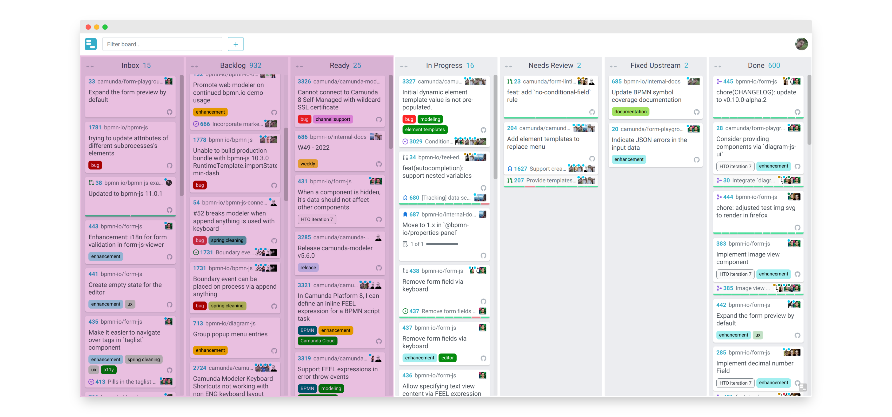

# The Making of [Wuffle](https://github.com/nikku/wuffle)

#### (A task board for [GitHub issues](https://guides.github.com/features/issues/))

<small><a href="https://github.com/nikku">Nico Rehwaldt</a></small>

---

---

## Why do we need a task board?

---

## Taskboard Benefits

* End-to-end visibility in what we're doing
* Connecting the dots
* Allows for light-weight planning
* :arrow_right: Empowers software delivery teams

---

## About [Wuffle](https://github.com/nikku/wuffle)

* A task board for [GitHub issues](https://guides.github.com/features/issues/)
* Connects to GitHub as a GitHub app
* Uses GitHub issues as the source of truth
* _Always up-to-date_ and _low/no maintainance_

---

## How does it work?

---

---

## And [philosophically](https://github.com/nikku/wuffle#philosophy)?

---

<!--config
align=center
-->

### You follow reasonable (:arrow_right: [GitHub Flow](https://guides.github.com/introduction/flow/)) practices and the board will always be up-to-date.

---

<!--config
align=center
-->

### You work across repositories and organizations and can still connect the dots.

---

<!--config
align=center
-->

### Move cards for pleasure and planning, not maintainance purposes.

---

## A Tool that Empowers

---

<!--config
align=center
-->

### Supports *inbox grooming*, *iteration planning*, and *delivery* in an agile fashion.

---

---

---

---

## [Demo](https://tasks.bpmn.io/board?c=%21Done%2C%21Inbox)

---

<!--config
align=center
-->

### :bulb:

### Works best if everyone (dev, design, pm) puts team related items on the board.

---

## Resources

* [GitHub](https://github.com/nikku/wuffle)
* [Documentation](https://github.com/nikku/wuffle/tree/master/docs#readme)
* [Demo](https://tasks.bpmn.io/)

---

## Thanks

# :heart: