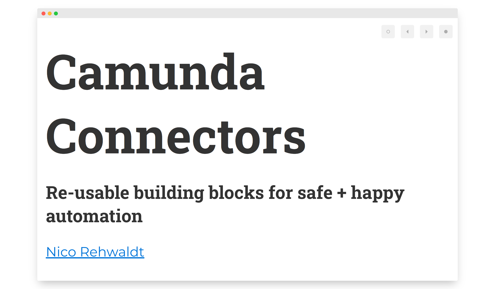
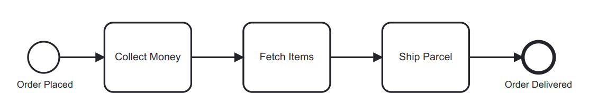
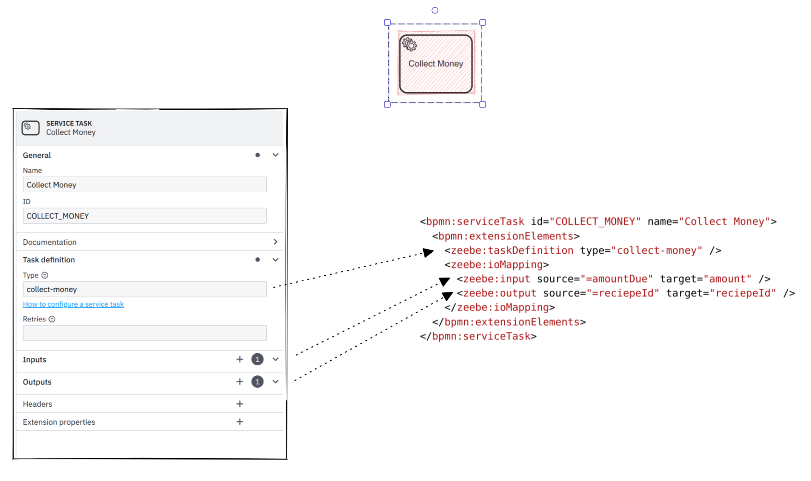
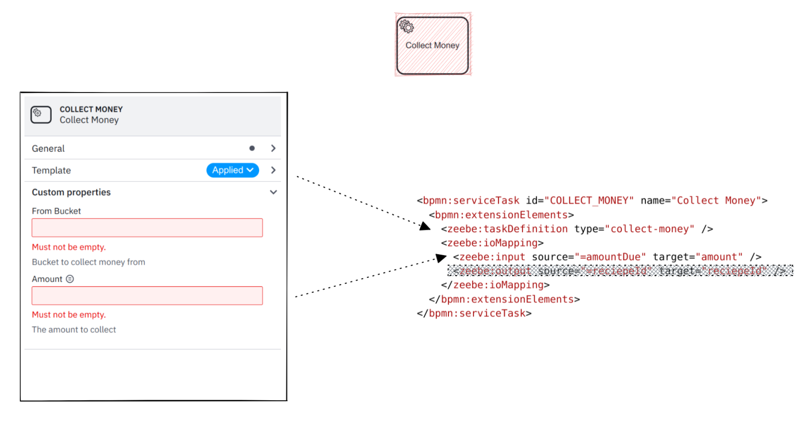
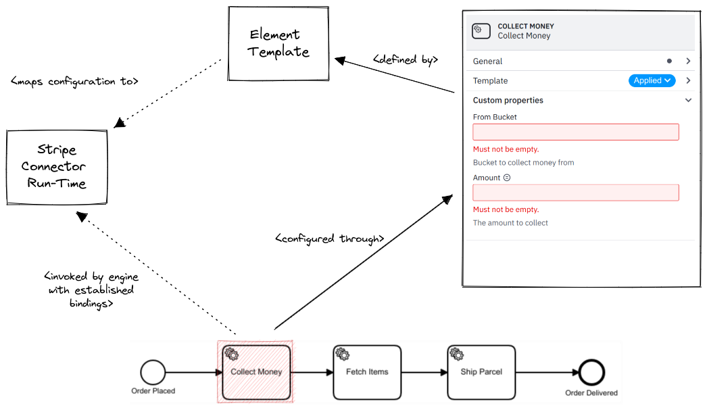

# Element Templates

#### Re-usable building blocks for process modeling

<small><a href="https://github.com/nikku">Nico Rehwaldt</a></small>

---

## Recap :arrow_down:

---

## Context

---

---

## Making a process executable

* Given a drawn BPMN diagram
* Attach executable meta-data to activities and events
* (So it ends up in the BPMN 2.0 XML file)
* Deploy BPMN 2.0 XML file to the engine

---

---

## Element Templates: The sugar on top

---

---

## Relation to Connectors

---

---

## For modeling users

* Offer a simple UI to configure re-usable building blocks
* Safe usage across diagram modifications + upgrading

---

### For Camunda developers

* A _framework_ to define _domain-specific building blocks_
* Ability to make technical bindings explicit
    * Configure task type
    * Explicitly map data
    * ...
* Control how implemention is being used

---

### Capabilities

* UI integration
* Validation, documentation, and linking
* Safe usage
* Upgrading baked-in

---

### Demo

---

### Takeaways

* [Element templates](https://docs.camunda.io/docs/components/modeler/desktop-modeler/element-templates/about-templates/) are a standalone feature
* We use them in C8 to implement [Camunda Connectors](https://docs.camunda.io/docs/components/connectors/use-connectors/)

---

### Resources

* [Core Element Template documentation](https://github.com/bpmn-io/element-templates)
* [Camunda Element Template documentation](https://docs.camunda.io/docs/components/modeler/desktop-modeler/element-templates/about-templates/)

---

## Thanks

# :heart: