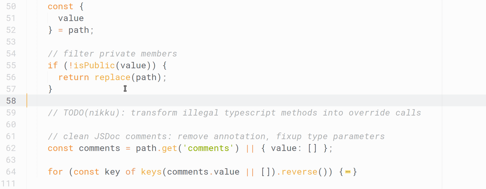

# _FEEL language tooling_

#### Imagining the future of editing support and how we get there.

<small><a href="https://github.com/nikku">Nico Rehwaldt</a></small>

---

### Disclaimer

This is a pitch and does not imply any future development direction. :crossed_fingers:

---

## History

---

---

---

---

<!--config
align=center
-->

## Lesson :one:

If we want our (low-code) personas to be more successful we'd want to invest into (FEEL) language tooling.

---

## Language tooling 101

---

---

<!--config
align=center
-->

## Lesson :two:

Language tooling has to be deeply integrated within our modelers, not only provided by an external editor.

---

### Baseline (any language)

* Syntax highlighting
* Smart indent
* Common keyboard shortcuts
* Completions

---

### Advanced (FEEL)

* Deep understanding of the language
* Contextual completion (i.e. based on available data)

---

### Demo: FEEL editing support

---

<!--config
align=center
-->

## Lesson :three:

We want to build great language tooling and embrace it across the stack.

---

### Demo: [Feel templating](https://github.com/bpmn-io/feelers)

---

## Mission*

#### _Offer state-of-the-art language support, language support that makes Camunda users more successful in process orchestration._

#### :arrow_right: Solution acceleration

---

## Strategy*

#### _Embrace a single script language: FEEL._

#### _Make additional language support pluggable. Establish best practices._

---

## Thanks

# :heart:

---

## Appendix

---

### Why FEEL?

* FEEL is defined as part of the [DMN specification](https://www.omg.org/spec/DMN/)
* It is the scripting language we chose for C8
* It is simple, and powerful :wink:

---

### Building Blocks

* [CodeMirror](https://codemirror.net/) recommended as foundation
* Pluggable language support
* [Grammar](https://github.com/nikku/lezer-feel) and [language](https://github.com/nikku/lang-feel) definitions for FEEL
* An [embeddable FEEL editor](https://github.com/bpmn-io/feel-editor)
* Extensible [variable resolver](https://github.com/bpmn-io/variable-resolver)