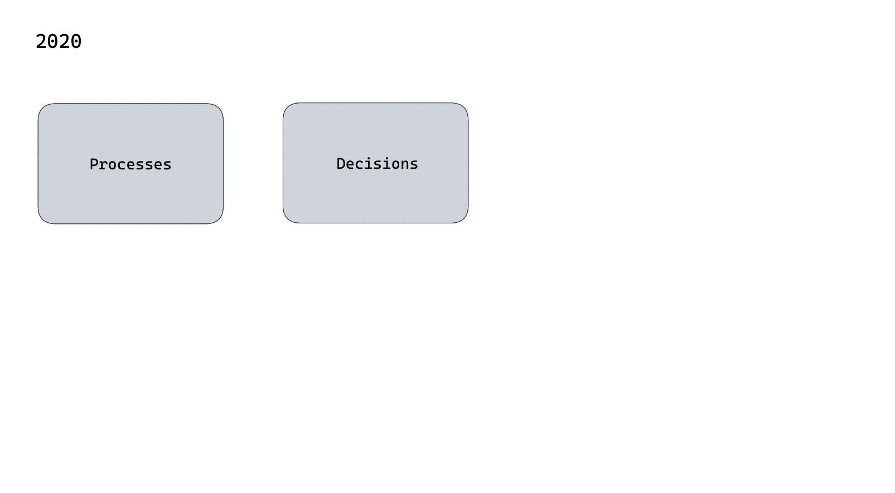
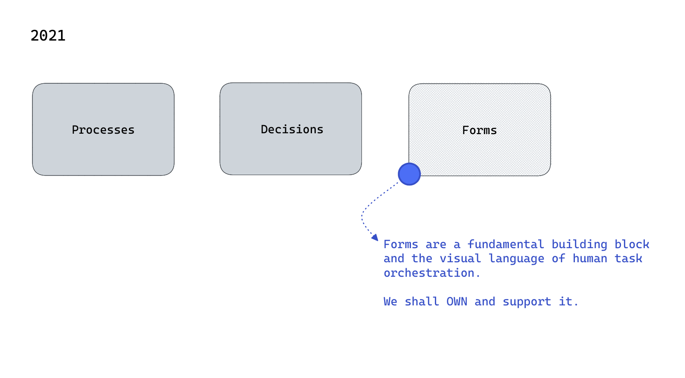
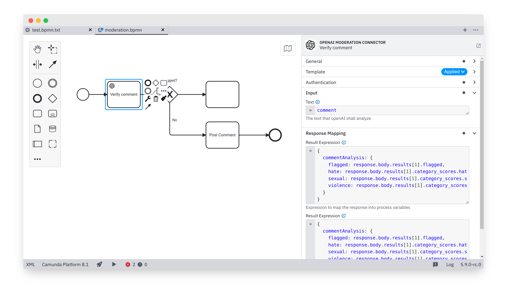
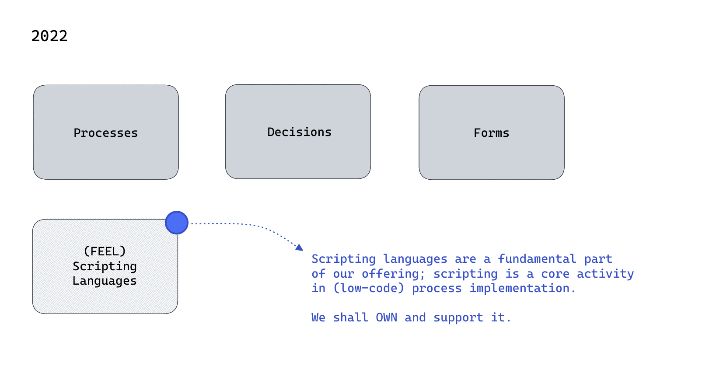

# _FEEL language tooling_

#### Imagining the future of editing support in Camunda and how we get there.

<small><a href="https://github.com/nikku">Nico Rehwaldt</a> 2023</small>

---

### Disclaimer*

This is a pitch and does not imply any current or future development direction. :crossed_fingers:

---

## Background

---

---

---

---

---

<!--config
align=center
theme=eco
-->

### Investing into (FEEL) language tooling will make our (low-code) users more successful in process orchestration.

---

## Language tooling?

---

## Text editor demo :frame_with_picture:

---

<!--config
align=center
theme=eco
-->

### Our users should not require external editors to do the job.

### Modelers should deeply integrate the language tooling.

---

## [FEEL editing](https://camunda.com/platform/modeler/) demo :frame_with_picture:

---

### Baseline (any language)

* Monospace
* Syntax highlighting
* Common keyboard shortcuts
* Smart indent
* Completions :question:

---

### Advanced (FEEL)

* Deep understanding of the language
* Contextual completion (i.e. based on available data)

---

<!--config
align=center
theme=eco
-->

### We want to start with FEEL language tooling and embrace it's use across the stack.

---

## [Feel templating](https://github.com/bpmn-io/feelers) demo :frame_with_picture:

---

### _Mission\*_ Make our users more successful in process orchestration through state-of-the-art language tooling.

##### :arrow_right: Solution acceleration; foundation for advanced features.

---

### _Strategy*_ Embrace FEEL. Make additional language tooling pluggable.

##### Provide building blocks and establish best practices.

---

## Thanks

# :heart:

---

## Appendix

---

### Why FEEL?

* FEEL is defined as part of the [DMN specification](https://www.omg.org/spec/DMN/)
* It is the scripting language in Camunda 8
* It is simple, and powerful :wink:

---

### Building blocks

* [CodeMirror](https://codemirror.net/) recommended as foundation
* Pluggable language support
* [Grammar](https://github.com/nikku/lezer-feel) and [language](https://github.com/nikku/lang-feel) definitions for FEEL
* An [embeddable FEEL editor](https://github.com/bpmn-io/feel-editor)
* Extensible [variable resolver](https://github.com/bpmn-io/variable-resolver)
* ...