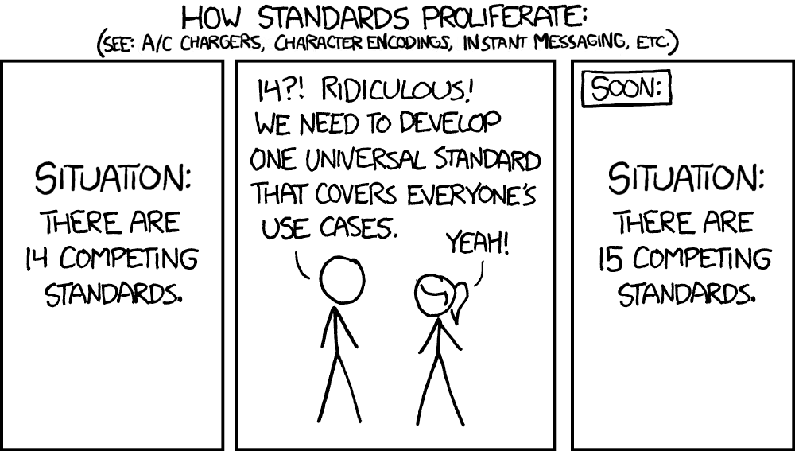

# *No Refactoring Issues*

#### The inevitable cleanup, and how not to do it.

<small>[`Nico Rehwaldt`](https://github.com/nikku) 2025</small>

---

#### :memo: Exercise your own judgement as you digest the contents of this presentation.

---

## Understanding *accidental* and *essential* complexity in software engineering.

---

#### *Essential* (inherent) complexity is caused by the problem to be solved, and cannot be removed.

#### *Accidental* complexity is what engineers create and can fix.

<small>Adapted from [No silver bullet](https://en.wikipedia.org/wiki/No_Silver_Bullet)</small>

---

## *Accidental complexity*

---

### Accidental complexity has many forms, in code and UX

A quick fix enables interaction `A`. As a result, the user journey `B` is broken.

We plan to do `X` as a first step towards a higher goal, but never follow up.

----

<!--config
name=accidental-complexity-design-time
-->

### Accidental complexity is often caused at design time, by insufficient understanding of the business domain.

---

### :speech_balloon: "Make this button red!"

### :question: "Should the user be able to execute this irreversible operation?"

---

<!--config
theme=eco
-->

#### [Most software] breaks because *teams lose alignment with the business problem they’re supposed to solve*. Systems become tangled with technical assumptions that age poorly ([ref](https://blog.bytebytego.com/p/domain-driven-design-ddd-demystified)).

---

### Accidental complexity is *inevitable*

Environments change, requirements change, rendering functionality outdated and dependencies vulnerable.

Over time any application decays in code and user experience, whether you touch it or not.

---

### We *introduce accidental complexity all the time*, through leaky abstractions, half-baked trade-offs, and "quick fixes".

---

### We want to *have measures to keep our applications in check*.

---

## Technical debt = *accidental complexity, in code*

---

#### [Technical debt is] a collection of design or implementation constructs that make future changes more costly or impossible ([ref](https://en.wikipedia.org/wiki/Technical_debt)).

---

---

## How to tame it? Through *refactoring*.

---

#### Refactoring is a [...] technique for restructuring an existing body of code, altering its internal structure without changing its external behavior ([ref](https://refactoring.com/)).

---

#### The goal of refactoring is to *adapt existing code* to *make new changes straightforward*.

---

#### Refactoring ensures that the application, over time, stays fit for purpose, for its use.

---

---

---

#### Refactoring keeps the system fit for purpose and the velocity in check.

---

---

#### By doing it *continuously*, we *keep the effort low*.

---

#### By doing it *continuously*, we *make it a habit*, a normal thing, an inherent part of our developer tool belt. We make it a path traveled.

---

---

#### By doing it *opportunistically*, *focusing on the current task* at hand, we ensure that *we do it where it matters most*: in critical code paths.

---

---

## Rules of (not) Refactoring

---

<!--config
theme=funky
-->

#### Our environment shapes us and we shape our environment.

---

### :speech_balloon: "I created an issue for it."

---

### :loudspeaker: "I *did not bother to fix this thing today, where I have context*, but hope a magic wizard will some day come and fix it."

---

### :bulb: Nobody is going to clean up after you. It is *your code base*, *your responsibility*. *You are* the one *suffering* from the mess you leave behind.

---

<!--config
name=no-refactoring-issues
-->

### :one: `no-refactoring-issues` - do not give yourself an easy excuse to offload work to your future self.

---

### :speech_balloon: "I don't dare to touch this code path, because I don't know what breaks."

---

### :loudspeaker: "*Our (automated) testing practice sucks.* I don't trust it to meaningfully report whats broken, when I change things."

---

### :loudspeaker: "*Our (automated) testing practice sucks.* I know I have to fix 1000 tests after this small change."

---

<!--config
name=functional-test-coverage
-->

### :bulb: A high functional test coverage gives you peace of mind that regardless of how much code you change things will be ok for your users.

---

<!--config
name=architect-for-testability
-->

### :two: `architect-for-testability` - build a system that is easy to test, and it will be well composed, easier to maintain, and understand. Support it with a comprehensive, fast, and reliable test suite.

---

### :speech_balloon: "I don't understand what our users are doing."

---

### :question: "How do you want to build a great experience supporting them?"

---

<!--config
name=understand-the-business-domain
-->

### :three: `understand-the-business-domain` - know what problems your users have, and choose the tools to support them wisely.

---

### :speech_balloon: "I could not fix it."

---

### :loudspeaker: "*I was too lazy to fix it*, and I hope someone else will do it someday."

---

### :question: Who is the magic wizard who can fix things for you?

---

<!--config
name=easier-when-practiced
-->

### :four: `easier-when-practiced` - Yes, refactoring can be complicated. It only gets harder if we don't practice it, or let the code base erode further. *Start refactoring today.*

---

### :speech_balloon: "I did not know cleaner was my job description."

---

### :loudspeaker: "I have a very simplistic view of what a [developer's job](https://github.com/nikku/talks/tree/main/2024-team-jobs-environment-composition#jobs-and-environment) is."

---

### :question: Who on your team ensures things are maintainable for the long run?

---

<!--config
name=embody-the-maintainer
-->

### :five: `embody-the-maintainer` - ensure that the maintainer perspective is part of [everything you do](https://github.com/nikku/talks/tree/main/2024-team-jobs-environment-composition#jobs-and-environment). Add it to your _definition of done_, enforce it.

---

### :speech_balloon: "I am behind schedule to wrap up this issue".

---

### :loudspeaker: "I keep the code base in this state so *I'll be behind schedule next time, too*".

---

<!--config
name=invest-in-tomorrow
-->

### :six: `invest-in-tomorrow` - do not accept today's excuses, invest reasonably to *set yourself up for (your) future success*.

---

<!--config
theme=eco
-->

### Always leave the campground cleaner than you found it.

###### (Boy scouts of America)

---

## When is a refactoring successful? *Is it always worth it?*

---

<!--config
theme=funky
-->

#### The way we approach things makes all the difference.

---

### :speech_balloon: "Next time we should clean this up."

---

### :bulb: No body is going to prioritize your *cleanup*, it *ships no user value*. Clean it up now, in context, or keep suffering.

---

<!--config
name=opportunistic-in-context
-->

### :one: `opportunistic-in-context` - make reasonable efforts to clean up the mess you encounter, while you have context. *It is cheaper now.*

---

### :speech_balloon: "I refactored, but the code base is no better now."

---

### :loudspeaker: "I changed things without a plan."

---

### :bulb: The feeling that "something is wrong" does not automatically lead to a successful outcome.

---

<!--config
name=know-what-and-why
-->

### :two: `know-what-and-why` - understand [what you do and why](https://fs.blog/chestertons-fence/), before you do. Use the plan to *assess* if the actual step of doing is *feasible* and *worth the effort*. If in doubt, get a second opinion.

---

### :speech_balloon: "Refactoring makes a code review hard to execute."

---

### :loudspeaker: "I did not properly structure my work, so others can follow along."

---

<!--config
name=make-it-explicit
-->

### :three: `make-it-explicit` - separate refactoring and feature development. Document [what changes, why](#know-what-and-why). Structure work in multiple PRs, or multiple commits.

---

### :speech_balloon: "Is this [bike-shedding](https://en.wikipedia.org/wiki/Law_of_triviality)?"

---

### :bulb: Be concious about your time. Put your attention to places _where it matters_. Be able to argue [what changes, why](#know-what-and-why). Get buy-in from your team.

---

<!--config
name=improve-substantially
-->

### :four:  `improve-substantially` - cosmetic changes are a waste of time and attention - refactor where it is worth the effort. Manage technical debt wisely, you'll never fully get rid of it anyway.

---

### :speech_balloon: "I refactored our test suite."

---

### :loudspeaker: "Now there is five ways to write our E2E tests."

---

---

### :bulb: Every additional pattern you introduce puts a mental toll on your future self.

---

<!--config
name=finish-what-you-started
-->

### :five:  `finish-what-you-started` - ensure new patterns are recognizable and fully adopted, at the very least on the the happy path of your application. Unbuild old cruft.

---

<!--config
theme=eco
-->

## Make refactoring and continuous improvement integral parts of our work.

---

### Getting there is a *cultural* and *technical challenge*

Cultural, because we need to get over old habbits, change our way of working.

Technical, because the first steps to a better code base are the hardest, and skills have to be learned.

---

### A [healthy environment](#environment) and following [basic rules of refactoring](#rules-of-refactoring) can help.

---

<!--config
name=environment
-->

### Environment

* [:one:](#no-refactoring-issues) `no-refactoring-issues`
* [:two:](#architect-for-testability) `architect-for-testability`
* [:three:](#understand-the-business-domain) `understand-the-business-domain`
* [:four:](#embody-the-maintainer) `embody-the-maintainer`
* [:five:](#easier-when-practiced) `easier-when-practiced`
* [:six:](#invest-in-tomorrow) `invest-in-tomorrow`

---

<!--config
name=rules-of-refactoring
-->

### Rules of refactoring

* [:one:](#know-what-and-why) `know-what-and-why`
* [:two:](#opportunistic-in-context) `opportunistic-in-context`
* [:three:](#make-it-explicit) `make-it-explicit`
* [:four:](#improve-substantially) `improve-substantially`
* [:five:](#finish-what-you-started) `finish-what-you-started`

---

<!--config
name=note-to-managers
-->

### Note to managers

* Empower your peers, setup a [healthy environment](#environment)
* Provide clear expectations, establish [accountability](https://www.merriam-webster.com/dictionary/accountability)
* Encourage folks to live by [the rules of refactoring](#rules-of-refactoring)
* Setup [friendly reminders](#definition-of-done)

---

## Thanks

# :heart:

---

## Appendix

---

### Things that may not work (1)

* **Refactoring Friday** - You'll never complete your refactoring in time.
* **Refactoring issues** - Offload today's responsibility to your future self.
* **30% time for refactoring** - Add this to the 13% working on papercuts, the 37.85% reviewing, the 20% discussing strategic matters, and the 23.14% coding.

---

### Things that may not work (2)

* **Rebuild periodically** - Nothing is more permanent than a temporary solution. Also, remember the [second system effect](https://en.wikipedia.org/wiki/Second-system_effect).
* **Solve it with more process** - What will this magic process be?

---

## Simple reminders can go a long way

---

<!--config
name=definition-of-done
-->

---

## Refactoring and (re-) architecting are related activities

---

