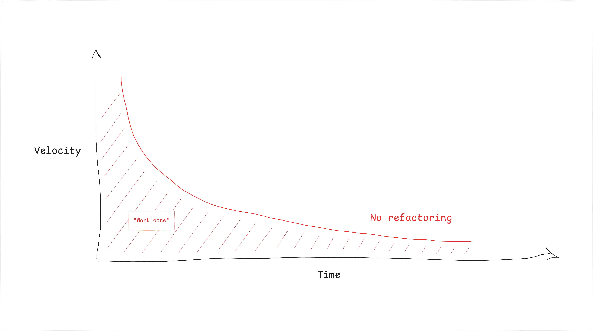

# No *Refactoring Issues*

#### The inevitable cleanup, and how not to do it.

<small>Nico Rehwaldt, 2025</small>

---

## Understanding *accidental* and *essential* complexity in software engineering.

---

#### *Accidental* complexity is what engineers create and can fix.

#### *Essential* (inherent) complexity is caused by the problem to be solved, and cannot be removed.

<small>Adapted from [No silver bullet](https://en.wikipedia.org/wiki/No_Silver_Bullet)</small>

---

### Accidental complexity has many forms, in code and UX

A quick fix enables interaction `A`; now, the existing user journey `B` is broken.

We plan to do `X` as a first step towards a higher goal, but never follow up.

----

#### We introduce accidental complexity all the time, through leaky abstractions, half-baked trade-offs, and "quick fixes".

---

### Accidental complexity is inevitable

The environment in which an application operates changes, rendering UIs outdated and dependencies vulnerable.

*Even if untouched, an application decays in code and user experience.*

---

### We want to have measures to keep our applications in check.

---

## Technical debt is accidental complexity, in code.

---

#### [Technical debt is] a collection of design or implementation constructs that make future changes more costly or impossible ([ref](https://en.wikipedia.org/wiki/Technical_debt)).

---

---

### How to tame it? Through *refactoring*.

---

#### Refactoring is a [...] technique for restructuring an existing body of code, altering its internal structure without changing its external behavior. ([ref](https://refactoring.com/))

---

#### The goal of refactoring is to adapt existing code to make new changes straightforward.

---

#### Refactoring ensures that the application, over time, stays fit for purpose, for its use.

---

---

---

#### Refactoring keeps the system fit for purpose and the velocity in check.

---

---

#### By doing it *continuously*, we *keep the effort low*.

---

#### By doing it *continuously*, we *make it a habit*, a normal thing, an inherent part of our developer tool belt. We make it a path traveled.

---

---

#### By doing it *opportunistically*, *focusing on the current task* at hand, we ensure that *we do it where it matters most*: in critical code paths.

---

---

## Rules of (not) refactoring

---

### :speech_balloon: "I created an issue for it."

---

### :loudspeaker: "I *did not bother to fix this thing today, where I have context*, but hope a magic wizard will some day come and fix it."

---

### :bulb: Nobody is going to clean up after you. It is *your code base*, *your responsibility*. *You are* the one *suffering* from the mess you leave behind.

---

### :one: `no-refactoring-issues` - do not allow "refactoring issues", fix things you encounter.

---

### :speech_balloon: "Next time we should clean this up."

---

### :bulb: No body is going to prioritize your *cleanup*, it *ships no user value*. Clean it up now, in context, or keep suffering.

---

### :two: `opportunistic-in-context` - make reasonable efforts to clean up the mess you encounter, while you have context. *It is cheaper now.*

---

### :speech_balloon: "I could not fix it."

---

### :loudspeaker: "*I was too lazy to fix it*, and I hope someone else will do it someday."

---

### :question: Who is the magic wizard who can fix things for you?

---

### :three: `easier-when-practiced` - Yes, refactoring can be complicated. It only gets harder if we don't practice it, or let the code base erode further. *Start refactoring today.*

---

### :speech_balloon: "I don't dare to touch this code path, because I don't know what breaks."

---

### :question: What magic bullet will fix this for you in the future?

---

### :four: `automated-testing-is-king` - *level up your testing practice*; ensure coverage is meaningful, quick to run, and easy to expand.

---

### :four: `architect-for-testability` - build a system that is easy to test, and it will be well composed, easier to maintain, and understand.

---

### :speech_balloon: "I did not know cleaner was my job description."

---

### :loudspeaker: "I have a very simplistic view of what a [developer's job](https://github.com/nikku/talks/tree/main/2024-team-jobs-environment-composition#jobs-and-environment) is."

---

### :question: Who on your team has cleaner in their job description? Who ensures things are maintainable for the long run?

---

### :five: `embody-the-maintainer` - ensure that the maintainer perspective is part of everything you do. Add it to your _definition of done_, enforce it.

---

### :speech_balloon: "I am behind schedule to wrap up this issue".

---

### :loudspeaker: "I keep the code base in this state so *I'll be behind schedule next time, too*".

---

### :six: `invest-in-tomorrow` - do not accept today's excuses, invest reasonably to *set yourself up for (your) future success*.

---

### Rules of refactoring

* :one: `no-refactoring-issues`
* :two: `opportunistic-in-context`
* :three: `easier-when-practiced`
* :four: `automated-testing-is-king` / `architect-for-testability`
* :five: `embody-the-maintainer`
* :six: `invest-in-tomorrow`

---

### Note to managers

* Make being a good maintainer part of your team's culture
* Provide clear expectations, establish accountability
* Empower your peers to live by [the rules of refactoring](#49)
* Setup friendly reminders, where needed (definition of done, PR templates)

---

## Thanks

# :heart:

---

## Appendix

---

### Things that don't work well (1)

* **Refactoring Friday** - You'll never complete your refactoring in time.
* **Refactoring issues** - Offload today's responsibility to your future self.
* **30% time for refactoring** - Add this to the 13% working on papercuts, the 37.85% reviewing, the 20% discussing strategic matters, and the 23.14% coding.

---

### Things that don't work well (2)

* **Rebuild periodically** - Nothing is more permanent than a temporary solution. Also, remember the [second system effect](https://en.wikipedia.org/wiki/Second-system_effect).
* **Solve it with more process** - What will this magic process be?