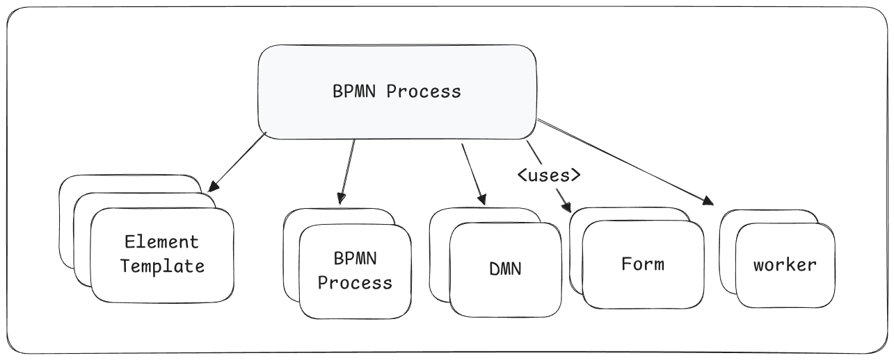
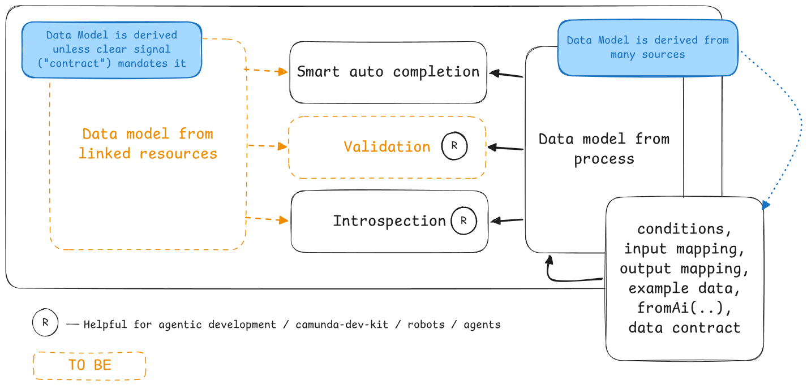

# Project Intelligence

A lightning talk on project intelligence, what it is, and how our users would benefit.

## Customer setup

In a typical Camunda automation project one BPMN process links to many external sources.

.

These resources can be any of:

* (Other) BPMN files (backing call activities)
* DMN decisions (backing business rule tasks)
* Forms (backing user tasks)
* Job workers (backing service tasks, execution listeners)

These other resources may be *part of the project* or *provided as re-usable building blocks* outside of the project.

In the case of re-use, the recommended pattern is to wrap them into an [element template](https://github.com/bpmn-io/element-templates) - the template enforces explicit input mapping - thereby defines a light-weight input contract.

## Project (Editor) Intelligence

Is the ability of our tooling to provide smart, helpful and context sensitive assistance to users while creating, modifying or inspecting a BPMN diagram.

.

Project intelligence has two sources: Local intelligence (from the current file/diagram) and project intelligence.

### Local sources

The local process data model, derived from many signals:

* conditions,
* input mapping
* output mapping,
* example data,
* fromAi(..),
* [future] data contract

This includes both data used and data written (produced).

### [future] Project sources

For external files, the tooling deduces an input and output contract. It has to be *inferred* unless it is explicitly defined through a dedicated data contract mechanism.

Example: Forms read and write many variables - without a dedicated contract, we cannot distinguish local (internal) variables from those that are part of the contract.

### Deriving insights

The tooling derives knowledge from available intelligence:

* Smart auto-completion: Local assistance when performing data mapping / authoring expressions
* Introspection: Variable outline helps to understand the data model and data lineage
* [future] Validation: Intelligence is used to check data use / mapping - detect and indicate mis-use before it is caught at run-time

## Example Scenarios

* I link a form (dmn, BPMN, job worker)
  => the editor picks up the form data schema
  => the editor offers me smart auto completion for input/output mappings
  => the editor validates if required inputs are provided

* I rename a variable in a linked form
  => the editor indicates the problem in my diagram ("variable not provided")
  => I can fix the issue, using smart assistance tools

* I define an agent ad-hoc sub process (AHSP) tool definition and mistype the variable name in the input mapping
  => editor validates used variables, indicates mis-use

## Relation to agentic development

Intelligence is available standalone ("headless"), so both robots (via CLI) and humans (via editor UI) can consume it. Agentic development can benefit in the same way, humans do.