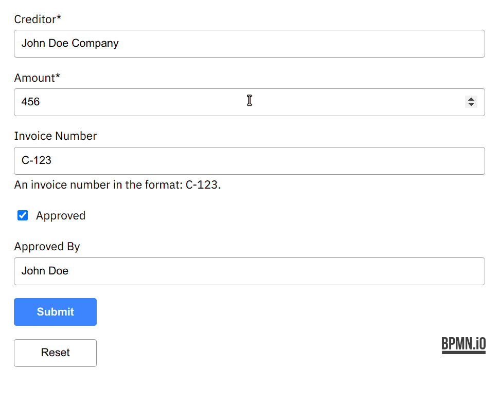
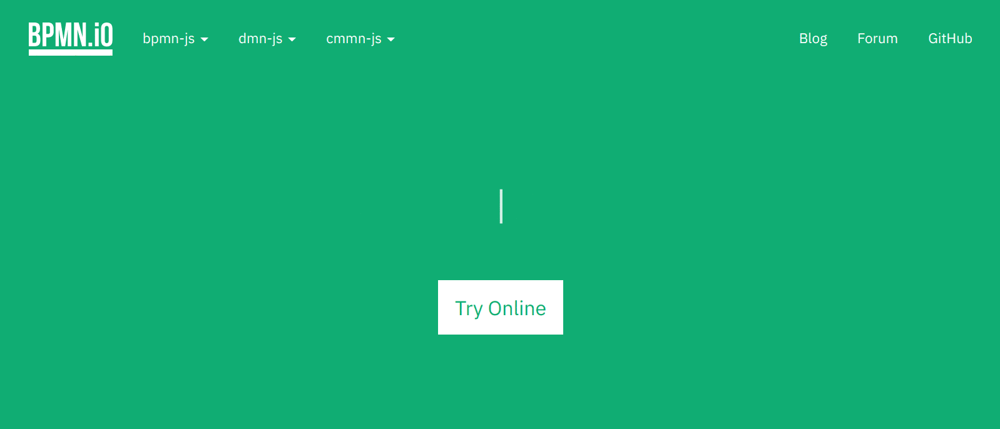

# Forms: What is :ship:ing

#### [`@nikku`](https://github.com/nikku)

---

## _New!_

* prefixed CSS
* read-only mode for forms
* validation pattern is optional

Remaining: [Cleanups](https://tasks.bpmn.io/board?s=milestone%3AF0%20)

---

<!--config
align=center
-->

## New: Default styles



---

## New name

```javascript
import {
  createForm
} from '@bpmn-io/form-js';

const form = createForm({
  schema,
  container
});

const { errors, data } = form.submit();
```

---

<!--config
theme=eco
-->

## Why `@bpmn-io/form-js`?

* We're building a low level library.
* Teams (Cloud, Platform) integrate it into our product stacks
* This is not a _ready to use_ standalone tool for customers

---

### So what about `camunda-forms`

* A tool that builds on top of `@bpmn-io/form-js`
* Integrates well into technology stacks (Angular, React, ...)
* Includes form definition and variable fetching, ...
* Ready for customers to build upon
* :arrow_right: __We are not there yet__

---

## Other Consequences

* [bpmn.io License licensed](https://github.com/bpmn-io/camunda-forms/pull/22) now
* Displays the project logo
* Logo shall be removed within our products

---

<!--config
align=center
-->

## `@bpmn_io` marketing



---

## Next Steps `@bpmn_io`

* Library release until end of the week.
* To be installed from `npmjs.com`
* Basic editor + integration into Camunda Modeler


---

## Thanks :heart:


[`@bpmn-io/form-js`](https://github.com/bpmn-io/form-js)