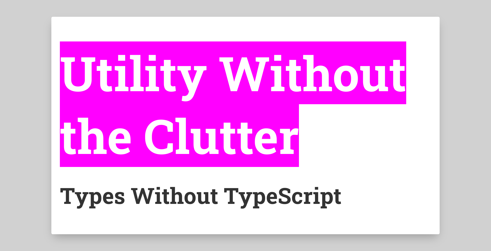

# Types Without TypeScript

A Camunda Tech Talk I gave early 2021.

[:arrow_right: Slides](https://nikku.github.io/talks/2021-token-simulation-internals/)

---

Slide deck built with [`pfwr`](https://github.com/nikku/pfwr) - Turns your markdown files into a beautiful slide deck.
