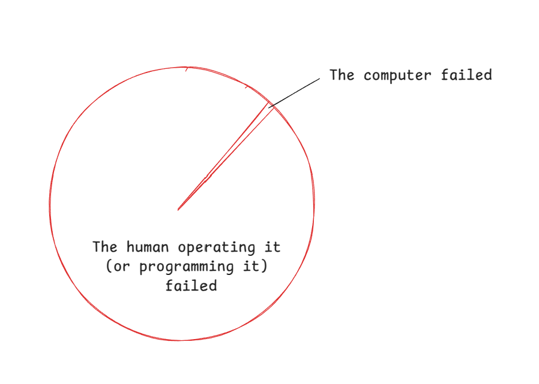
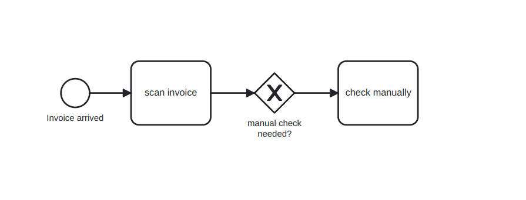
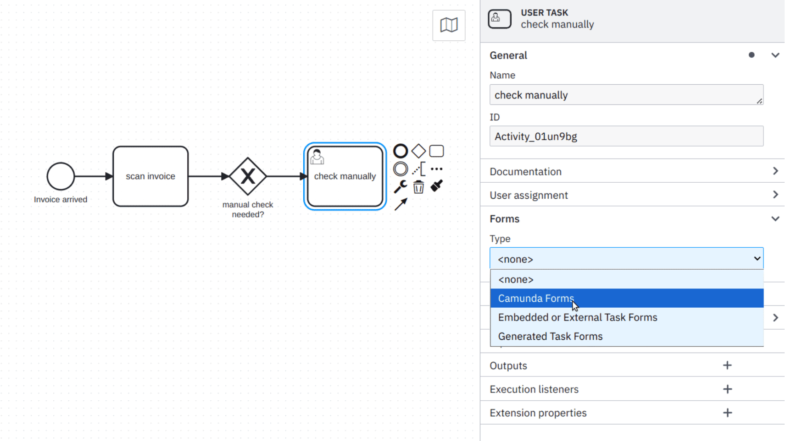
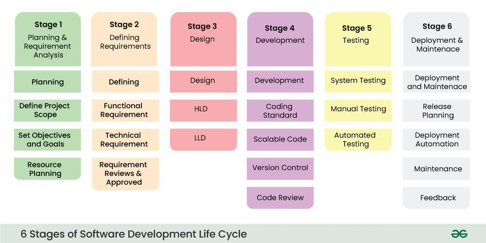
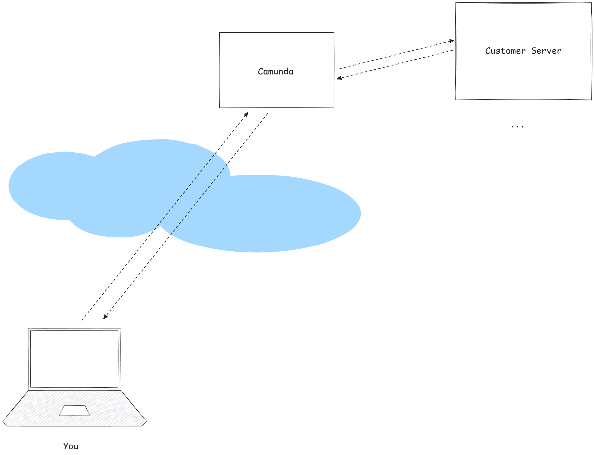
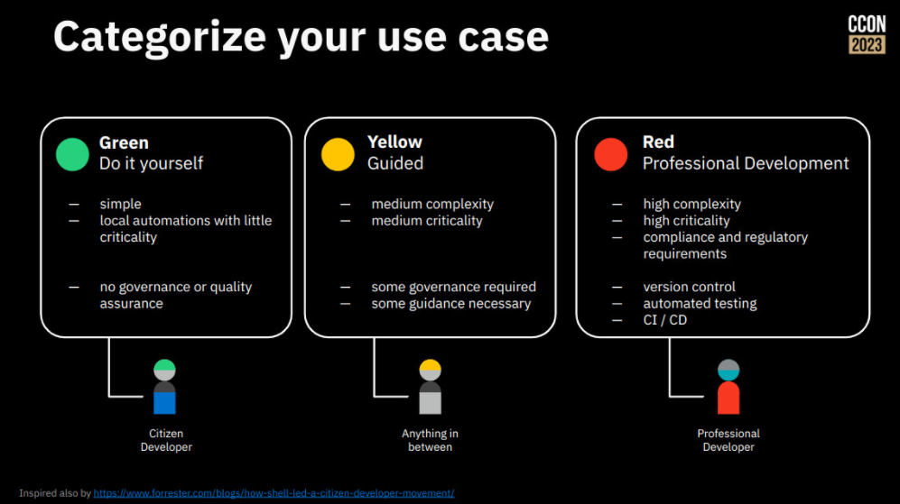
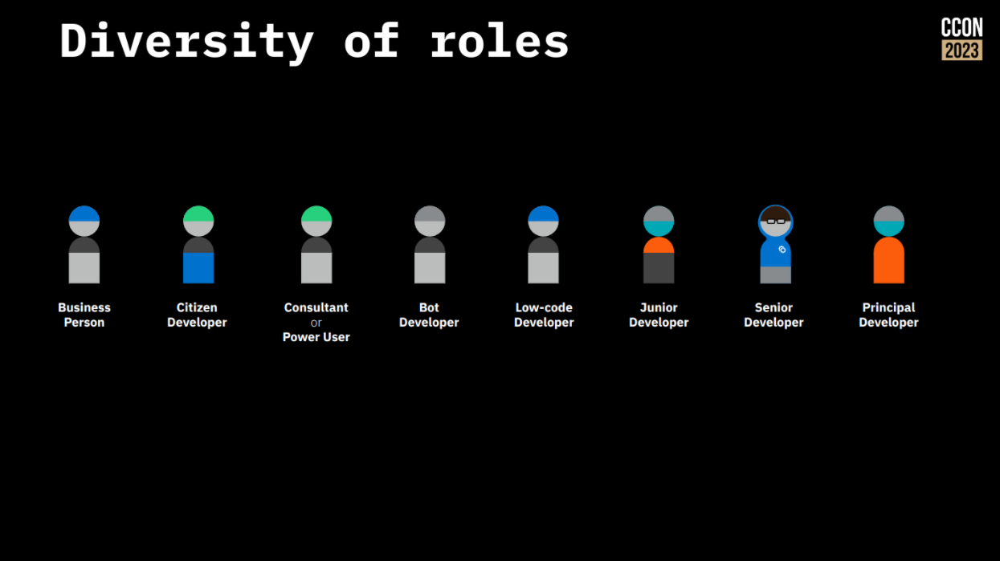
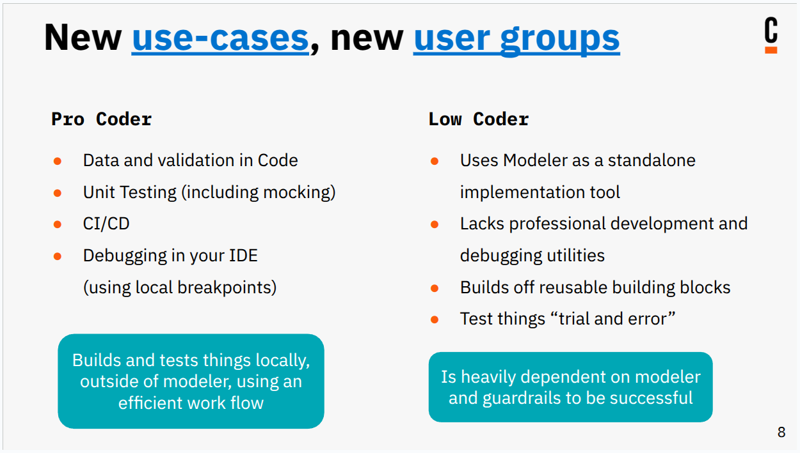

## _How the engine works_

#### A tale on computer systems, and how to work with them.

<small>[`Nico Rehwaldt`](https://github.com/nikku) 2025</small>

---

## How does the *engine* work?

---

## How does a *computer* work?

---

### A computer takes *instructions*, and *executes* them.
### It *does not guess*, it *does not discuss*.

---

<!--
align: center
-->

It always worked that way, and when it works differently, then it is developed that way.

---

## What does this mean for *humans operating it*?

---

---

## When things go awry, a human is to blame.

---

---

## Why would you still use a computer?

---

## A computer only does the mistakes that *you told it to do*.

## It *executes things at scale*, never gets tired.

---

## How should a human operate a computer?

---

### You should *know what you do and why*.
### You want to *test things*, to verify your assumptions are correct.

---

### You look to (good) tools to support you in being successful.

### You follow a [structured approach](https://www.geeksforgeeks.org/software-development-life-cycle-sdlc/).

---

## Computers are *built to prevent grave consequences*.

---

### User failure: Prevent accidentally harm by confirming dangerous computations, support testing in non-critical environments.

---

### (Rare) Computer failure: Safe-guard mission critical computation, let multiple computers do the work (i.e. on a plane).

---

## So again, how does the [[Camunda]](https://camunda.com/) *engine* work?

---

## You *model* what to execute, visually, using BPMN.

---

---

## *Additional configuration* you attach to each step tells the engine how it shall be executed.

---

---

## You *deploy* a BPMN process to the engine, hence telling it what exactly to execute.

---

## The engine executes what you told it to do

* When you ask it to start a process instance
* When an event happens (timer elapsed, message arrived, condition fulfilled)
* When a piece of work should be started, or completes

---

## The engine executes without magic

* It executes what you *deployed*, as you specified it
* It keeps track of things:
  * deployed *process definitions*
  * running *process instances*
  * active *tasks* and *event subscriptions*

---

## The engine executes at scale

* It is great at waiting
* It executes fast and handles high load

---

## Thanks

# :heart:

---

## Appendix

---

## You develop Camunda no different than you develop any other software.

---

---

## It matters "where the thing runs"

---

---

## Because this means different context is available.

---

## There is many "engines"

* BPMN engine - executes BPMN inside of Camunda 8
* [dmn-scala](https://github.com/camunda/dmn-scala) - evaluates DMN decisions inside of Camunda 8
* [feel-scala](https://github.com/camunda/feel-scala) - evaluates FEEL expressions inside of Camunda 8
* ["feel-js"](https://github.com/nikku/feelin) - is used in the modeling stack or browser context to evalute FEEL

---

## Many "engines"

* [bpmn-js](https://github.com/bpmn-io/bpmn-js) - embed, display and edit BPMN diagrams in a browser environment
* [form-js](https://github.com/bpmn-io/form-js) - embed, display and edit Forms in a browser environment
* ...

---

## It matters what a Camunda developer does

* You implement an E2E process, you *deliver an experience to end-users*
* You implement a re-usable building block, you *provide infrastructure* to others

---

## *What* you build for *whom* changes your way of working

---

---

## Where a Camunda developer works matters, and so does their technical expertise

---

---

## Modeler: Supporting *Camunda implementation* in different *environments*, for *different personas*

---

